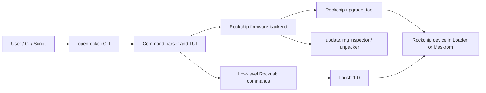
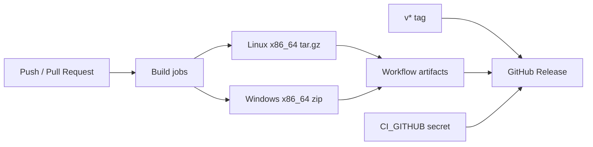

# OpenRockCLI

A command-line and lightweight TUI firmware flashing tool for Rockchip SoCs.
It keeps low-level Rockchip maskrom/loader commands and adds an
OpenixCLI-compatible workflow for scanning devices and flashing Rockchip
`update.img` firmware packages.

## Features

- Device scanning with USB bus/port, mode, VID/PID, and chip name
- OpenixCLI-compatible commands: `scan`, `flash`, `tui`
- Rockchip firmware helper commands: `devices`, `inspect`, `unpack`
- Rockchip `update.img` flashing through the SDK bundled `upgrade_tool`
- Firmware info and extraction helpers
- Original low-level maskrom, storage, flash, OTP, and vendor storage commands

## Architecture



The OpenixCLI-style commands (`scan`, `flash`, `devices`, `inspect`, `unpack`,
and `tui`) live in the CLI layer. Firmware package flashing is delegated to the
Rockchip `upgrade_tool` when that is the safest path. The original low-level
Rockusb commands continue to use libusb directly.

## Source Layout

```text
openrockcli/
├── .github/workflows/      GitHub Actions build and release workflow
├── include/                Public and internal C headers
├── payloads/               Maskrom helper payload sources
├── src/                    C implementation files
├── 99-openrockcli.rules    Linux udev rules
├── Makefile                Native Linux build
├── Makefile.win            MinGW Windows build
└── README.md
```

## How to build

### Linux platform

OpenRockCLI depends on the `libusb-1.0` library. Install `libusb-1.0-0-dev`
before compiling, for example in Ubuntu:

```shell
sudo apt install libusb-1.0-0-dev
```

For Ubuntu users, release builds also provide an `amd64` `.deb` package:

```shell
sudo apt install ./openrockcli_*_amd64.deb
openrockcli --version
```

Then just type `make` at the root directory, you will see a binary program.

```shell
cd openrockcli
make
sudo make install
```

The `flash`, `devices`, `inspect`, and `unpack` commands use the
Rockchip `upgrade_tool`. By default openrockcli searches the SDK bundled tool at:

```shell
tools/linux/Linux_Upgrade_Tool/Linux_Upgrade_Tool/upgrade_tool
```

You can override it:

```shell
OPENROCKCLI_UPGRADE_TOOL=/path/to/upgrade_tool openrockcli devices
```

### Window platform

Install some build tools

```shell
sudo apt install mingw-w64
sudo apt install autoconf
sudo apt install libtool-bin
```

Download and install libusb

```shell
git clone https://github.com/libusb/libusb.git
cd libusb
./autogen.sh
./configure --host=x86_64-w64-mingw32 --prefix=/usr/x86_64-w64-mingw32/
make
sudo make install
```

Build openrockcli source code

```shell
cd openrockcli
CROSS=x86_64-w64-mingw32- make -f Makefile.win
```

For 32-bits windows, you can using `i686-w64-mingw32-` instead of `x86_64-w64-mingw32` above.

The release workflow builds the Windows package with MSYS2 UCRT64 and includes
the required runtime DLLs in the zip package. The Windows build supports USB
scanning and low-level libusb commands. `update.img` workflows that shell out to
Rockchip `upgrade_tool` are available in the Linux build.

## OpenixCLI-Compatible Usage

Show the OpenixCLI-style command surface:

```shell
openrockcli --help
openrockcli --version
openrockcli help flash
openrockcli help tui
```

Launch the interactive TUI:

```shell
openrockcli
openrockcli tui
```

Scan for Rockchip USB devices:

```shell
openrockcli scan
```

List devices through Rockchip `upgrade_tool`:

```shell
openrockcli devices
```

Inspect firmware package info:

```shell
openrockcli inspect update.img
```

Extract firmware package contents:

```shell
openrockcli unpack update.img ./extracted
```

Flash firmware:

```shell
openrockcli flash update.img [options]
```

### Flash Options

| Option | Short | Description |
|--------|-------|-------------|
| `--bus` | `-b` | USB bus selector shown by `scan` |
| `--port` | `-P` | USB port selector shown by `scan` |
| `--verify` | `-V` | Enable verification preference; also accepts `true` or `false` |
| `--no-verify` | | Disable verification preference |
| `--mode` | `-m` | `partition`, `keep_data`, `partition_erase`, or `full_erase` |
| `--partitions` | `-p` | Comma-separated partition names for `--mode partition` |
| `--post-action` | `-a` | `reboot`, `poweroff`, or `shutdown` |
| `--verbose` | `-v` | Print selected options |

Examples:

```shell
openrockcli flash update.img --verbose
openrockcli flash update.img --post-action poweroff
openrockcli flash update.img --mode full_erase --verify true
openrockcli flash update.img --mode partition --partitions boot,uboot,misc,recovery
openrockcli flash update.img --mode partition --partitions rootfs,oem,userdata
```

Notes:

- Rockchip `update.img` flashing is delegated to `upgrade_tool UF`.
- `--mode partition` extracts `update.img` with `upgrade_tool EXF` and flashes
  selected entries. Known `upgrade_tool DI` partitions use `DI`; other package
  entries such as `rootfs`, `oem`, and `userdata` are written by parsing
  `parameter.txt` and calling `upgrade_tool WL`.
- Current partition flashing supports `boot`, `uboot`, `misc`, `recovery`,
  `kernel`, `system`, `trust`, `resource`, `rootfs`, `oem`, and `userdata`.
- Bus/port, non-partition modes, and verify options are accepted for an
  OpenixCLI-compatible command surface; `upgrade_tool` ultimately controls how
  Rockchip update packages are applied.
- `poweroff` and `shutdown` map to Rockchip `upgrade_tool UF -noreset`,
  because `upgrade_tool` does not expose a real power-off action for
  `update.img` flashing.
- For raw sector operations, use the original low-level `openrockcli flash read`,
  `openrockcli flash write`, and `openrockcli flash erase` commands below.

## Low-level Usage

Low-level Rockchip commands are still available behind the OpenixCLI-style
entry points:

```shell
openrockcli help low-level
```

```shell
usage:
    openrockcli                              - Launch interactive TUI
    openrockcli tui                          - Launch interactive TUI
    openrockcli scan                         - List connected Rockchip USB devices
    openrockcli devices                      - List Rockusb devices with upgrade_tool
    openrockcli inspect <firmware.img>       - Inspect Rockchip firmware package
    openrockcli unpack <firmware.img> <dir>  - Unpack Rockchip firmware package
    openrockcli flash <firmware.img> [opts]  - Flash Rockchip update.img via upgrade_tool
    openrockcli maskrom <ddr> <usbplug> [--rc4-off]    - Initial chip using ddr and usbplug in maskrom mode
    openrockcli download <loader>                      - Initial chip using loader in maskrom mode
    openrockcli upgrade <loader>                       - Upgrade loader to flash in loader mode
    openrockcli ready                                  - Show chip ready or not
    openrockcli version                                - Show chip version
    openrockcli capability                             - Show capability information
    openrockcli reset [maskrom]                        - Reset chip to normal or maskrom mode
    openrockcli dump <address> <length>                - Dump memory region in hex format
    openrockcli read <address> <length> <file>         - Read memory to file
    openrockcli write <address> <file>                 - Write file to memory
    openrockcli exec <address> [dtb]                   - Call function address(Recommend to use extra command)
    openrockcli otp <length>                           - Dump otp memory in hex format
    openrockcli sn                                     - Read serial number
    openrockcli sn <string>                            - Write serial number
    openrockcli vs dump <index> <length> [type]        - Dump vendor storage in hex format
    openrockcli vs read <index> <length> <file> [type] - Read vendor storage
    openrockcli vs write <index> <file> [type]         - Write vendor storage
    openrockcli storage                                - Read storage media list
    openrockcli storage <index>                        - Switch storage media and show list
    openrockcli flash                                  - Detect flash and show information
    openrockcli flash erase <sector> <count>           - Erase flash sector
    openrockcli flash read <sector> <count> <file>     - Read flash sector to file
    openrockcli flash write <sector> <file>            - Write file to flash sector
extra:
    openrockcli extra maskrom --rc4 <on|off> [--sram <file> --delay <ms>] [--dram <file> --delay <ms>] [...]
    openrockcli extra maskrom-dump-arm32 --rc4 <on|off> --uart <register> <address> <length>
    openrockcli extra maskrom-dump-arm64 --rc4 <on|off> --uart <register> <address> <length>
    openrockcli extra maskrom-write-arm32 --rc4 <on|off> <address> <file>
    openrockcli extra maskrom-write-arm64 --rc4 <on|off> <address> <file>
    openrockcli extra maskrom-exec-arm32 --rc4 <on|off> <address>
    openrockcli extra maskrom-exec-arm64 --rc4 <on|off> <address>
```

## Tips

- The maskrom command can only used in maskrom mode, Before executing other commands, you must first execute the maskrom command

- The memory base address from 0, **NOT** sdram's physical address.

- In some u-boot rockusb driver, The flash dump operation be limited to the start of 32MB, you can patch u-boot's macro `RKUSB_READ_LIMIT_ADDR`.

```
diff --git a/u-boot/cmd/rockusb.c b/u-boot/cmd/rockusb.c
--- a/u-boot/cmd/rockusb.c
+++ b/u-boot/cmd/rockusb.c
@@ -26,7 +26,7 @@ static int rkusb_read_sector(struct ums *ums_dev,
        lbaint_t blkstart = start + ums_dev->start_sector;
        int ret;

-       if ((blkstart + blkcnt) > RKUSB_READ_LIMIT_ADDR) {
+       if ((blkstart + blkcnt) > RKUSB_READ_LIMIT_ADDR && 0) {
                memset(buf, 0xcc, blkcnt * SECTOR_SIZE);
                return blkcnt;
        } else {
```

### RV1106

```shell
openrockcli maskrom rv1106_ddr_924MHz_v1.15.bin rv1106_usbplug_v1.09.bin --rc4-off
openrockcli version
```

```shell
openrockcli extra maskrom --rc4 off --sram rv1106_ddr_924MHz_v1.15.bin --delay 10 --rc4 off --dram rv1106_usbplug_v1.09.bin --delay 10
openrockcli version
```

- Initial ddr memory

```shell
openrockcli extra maskrom --rc4 off --sram rv1106_ddr_924MHz_v1.15.bin --delay 10
```

- Dump memory region in hex format by debug uart

```shell
openrockcli extra maskrom-dump-arm32 --rc4 off --uart 0xff4c0000 0xffff0000 1024
```

- Initial ddr memory and wirte `xstar.bin` to memory and jump to running

```shell
openrockcli extra maskrom --rc4 off --sram rv1106_ddr_924MHz_v1.15.bin --delay 10
openrockcli extra maskrom-write-arm32 --rc4 off 0x00000000 xstar.bin
openrockcli extra maskrom-exec-arm32 --rc4 off 0x00000000
```

### RK1808

```shell
openrockcli maskrom rk1808_ddr_933MHz_v1.05.bin rk1808_usbplug_v1.05.bin
openrockcli version
```

```shell
openrockcli extra maskrom --rc4 on --sram rk1808_ddr_933MHz_v1.05.bin --delay 10 --rc4 on --dram rk1808_usbplug_v1.05.bin --delay 10
openrockcli version
```

- Initial ddr memory

```shell
openrockcli extra maskrom --rc4 on --sram rk1808_ddr_933MHz_v1.05.bin --delay 10
```

- Dump bootrom region in hex format by debug uart

```shell
openrockcli extra maskrom-dump-arm64 --rc4 on --uart 0xff550000 0xffff0000 1024
```

### RK3128

```shell
openrockcli maskrom rk3128_ddr_300MHz_v2.12.bin rk3128_usbplug_v2.63.bin
openrockcli version
```

```shell
openrockcli extra maskrom --rc4 on --sram rk3128_ddr_300MHz_v2.12.bin --delay 10 --rc4 on --dram rk3128_usbplug_v2.63.bin --delay 10
openrockcli version
```

- Initial ddr memory

```shell
openrockcli extra maskrom --rc4 on --sram rk3128_ddr_300MHz_v2.12.bin --delay 10
```

- Dump memory region in hex format by debug uart

```shell
openrockcli extra maskrom-dump-arm32 --rc4 on --uart 0xff1a0000 0x60000000 1024
```

### RK3288

```shell
openrockcli maskrom rk3288_ddr_400MHz_v1.11.bin rk3288_usbplug_v2.63.bin
openrockcli version
```

```shell
openrockcli extra maskrom --rc4 on --sram rk3288_ddr_400MHz_v1.11.bin --delay 10 --rc4 on --dram rk3288_usbplug_v2.63.bin --delay 10
openrockcli version
```

- Initial ddr memory

```shell
openrockcli extra maskrom --rc4 on --sram rk3288_ddr_400MHz_v1.11.bin --delay 10
```

- Dump memory region in hex format by debug uart

```shell
openrockcli extra maskrom-dump-arm32 --rc4 on --uart 0xff690000 0x60000000 1024
```

### RK3399

```shell
openrockcli maskrom rk3399_ddr_800MHz_v1.30.bin rk3399_usbplug_v1.30.bin
openrockcli version
```
```shell
openrockcli extra maskrom --rc4 on --sram rk3399_ddr_800MHz_v1.30.bin --delay 10 --rc4 on --dram rk3399_usbplug_v1.30.bin --delay 10
openrockcli version
```

- Initial ddr memory

```shell
openrockcli extra maskrom --rc4 on --sram rk3399_ddr_800MHz_v1.30.bin --delay 10
```

- Dump rk3399 bootrom region in hex format by debug uart

```shell
openrockcli extra maskrom-dump-arm64 --rc4 on --uart 0xff1a0000 0xfffd0000 1024
```

### RK3399PRO

```shell
openrockcli maskrom rk3399pro_ddr_666MHz_v1.25.bin rk3399pro_usbplug_v1.26.bin
openrockcli version
```

```shell
openrockcli extra maskrom --rc4 on --sram rk3399pro_ddr_666MHz_v1.25.bin --delay 10 --rc4 on --dram rk3399pro_usbplug_v1.26.bin --delay 10
openrockcli version
```

### PX30

```shell
openrockcli maskrom px30_ddr_333MHz_v1.16.bin px30_usbplug_v1.31.bin
openrockcli version
```

```shell
openrockcli extra maskrom --rc4 on --sram px30_ddr_333MHz_v1.16.bin --delay 10 --rc4 on --dram px30_usbplug_v1.31.bin --delay 10
openrockcli version
```

- Initial ddr memory

```shell
openrockcli extra maskrom --rc4 on --sram px30_ddr_333MHz_v1.16.bin --delay 10
```

- Dump bootrom region in hex format by debug uart

```shell
openrockcli extra maskrom-dump-arm64 --rc4 on --uart 0xff160000 0xffff0000 1024
```

### RK3308

```shell
openrockcli maskrom rk3308_ddr_589MHz_uart2_m1_v1.31.bin rk3308_usbplug_v1.27.bin
openrockcli version
```

```shell
openrockcli extra maskrom --rc4 on --sram rk3308_ddr_589MHz_uart2_m1_v1.31.bin --delay 10 --rc4 on --dram rk3308_usbplug_v1.27.bin --delay 10
openrockcli version
```

### RK3566

```shell
openrockcli maskrom rk3566_ddr_1056MHz_v1.11.bin rk356x_usbplug_v1.13.bin --rc4-off
openrockcli version
```

```shell
openrockcli extra maskrom --rc4 off --sram rk3566_ddr_1056MHz_v1.11.bin --delay 10 --rc4 off --dram rk356x_usbplug_v1.13.bin --delay 10
openrockcli version
```

### RK3568

```shell
openrockcli maskrom rk3568_ddr_1560MHz_v1.11.bin rk356x_usbplug_v1.13.bin --rc4-off
openrockcli version
```

```shell
openrockcli extra maskrom --rc4 off --sram rk3568_ddr_1560MHz_v1.11.bin --delay 10 --rc4 off --dram rk356x_usbplug_v1.13.bin --delay 10
openrockcli version
```

### RK3588

```shell
openrockcli maskrom rk3588_ddr_lp4_2112MHz_lp5_2400MHz_v1.16.bin rk3588_usbplug_v1.11.bin --rc4-off
openrockcli version
```

```shell\
openrockcli extra maskrom --rc4 off --sram rk3588_ddr_lp4_2112MHz_lp5_2400MHz_v1.16.bin --delay 10 --rc4 off --dram rk3588_usbplug_v1.11.bin --delay 10
openrockcli version
```

- Initial ddr memory

```shell
openrockcli extra maskrom --rc4 off --sram rk3588_ddr_lp4_2112MHz_lp5_2400MHz_v1.16.bin --delay 10
```

- Dump memory region in hex format by debug uart

```shell
openrockcli extra maskrom-dump-arm64 --rc4 off --uart 0xfeb50000 0xffff0000 1024
```

### RK3562

```shell
openrockcli maskrom rk3562_ddr_1332MHz_v1.05.bin rk3562_usbplug_v1.04.bin --rc4-off
openrockcli version
```

```shell
openrockcli extra maskrom --rc4 off --sram rk3562_ddr_1332MHz_v1.05.bin --delay 10 --rc4 off --dram rk3562_usbplug_v1.04.bin --delay 10
openrockcli version
```

### RK3576

```shell
openrockcli maskrom rk3576_ddr_lp4_2112MHz_lp5_2736MHz_v1.05.bin rk3576_usbplug_v1.02.bin --rc4-off
openrockcli version
```

```shell
openrockcli extra maskrom --rc4 off --sram rk3576_ddr_lp4_2112MHz_lp5_2736MHz_v1.05.bin --delay 10 --rc4 off --dram rk3576_usbplug_v1.02.bin --delay 10
openrockcli version
```

- Initial ddr memory

```shell
openrockcli extra maskrom --rc4 off --sram rk3576_ddr_lp4_2112MHz_lp5_2736MHz_v1.05.bin --delay 10
```

- Dump memory region in hex format by debug uart

```shell
openrockcli extra maskrom-dump-arm64 --rc4 off --uart 0x2ad40000 0x3ff81000 1024
```

### RK3506

```shell
openrockcli maskrom rk3506b_ddr_750MHz_v1.04.bin rk3506_usbplug_v1.02.bin --rc4-off
openrockcli version
```

```shell
openrockcli extra maskrom --rc4 off --sram rk3506b_ddr_750MHz_v1.04.bin --delay 10 --rc4 off --dram rk3506_usbplug_v1.02.bin --delay 10
openrockcli version
```

- Initial ddr memory

```shell
openrockcli extra maskrom --rc4 off --sram rk3506b_ddr_750MHz_v1.04.bin --delay 10
```

- Dump memory region in hex format by debug uart

```shell
openrockcli extra maskrom-dump-arm32 --rc4 off --uart 0xff0a0000 0xff910000 1024
```

## Links

* [The rockchip loader binaries](https://github.com/rockchip-linux/rkbin)
* [The rockchip rkdeveloptool](https://github.com/rockchip-linux/rkdeveloptool)

## CI Release

GitHub Actions builds Linux and Windows x86_64 binaries on push, pull request, and manual dispatch.



To publish a release:

1. Add a repository secret named `CI_GITHUB` with release permission.
2. Push a version tag:

```shell
git tag v1.2.0
git push origin v1.2.0
```

The workflow uploads:

- `openrockcli-linux-x86_64.tar.gz`
- `openrockcli_<version>_amd64.deb`
- `openrockcli-windows-x86_64.zip`
- SHA256 files for release packages

## License

This library is free software; you can redistribute it and or modify it under the terms of the MIT license. See [MIT License](LICENSE) for details.
